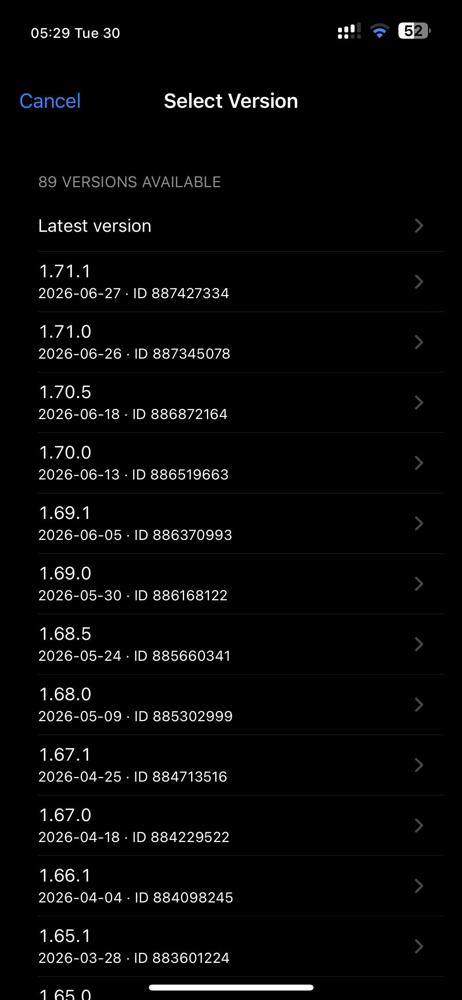
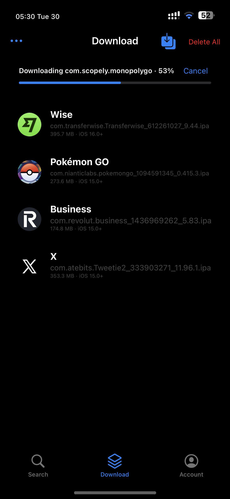
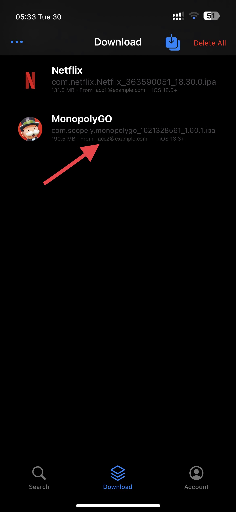
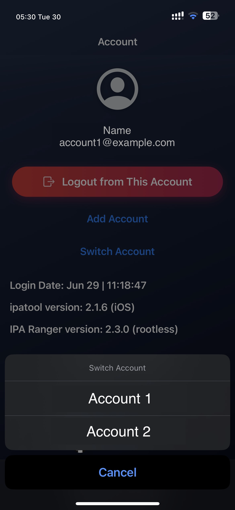

# IPARanger Experimental Fork

This is an unofficial experimental fork of [0xkuj/IPARanger](https://github.com/0xkuj/IPARanger).

I made these changes mostly for personal use and experimentation. If they help someone else, great. If not, no worries. This is not intended to replace the original project or take credit for it.

The original app downloads encrypted IPA files from the App Store using an Apple ID account, through [majd/ipatool](https://github.com/majd/ipatool).

## Compatibility / support disclaimer

This fork was tested on my own device and setup only. I used it on a rootless jailbreak environment (Dopamine, iOS 16.4), and I cannot guarantee that it will behave the same way on other iOS versions, other jailbreaks, or rootful setups.

Some parts may fail, behave differently, or crash entirely depending on your environment. This is shared as an experimental fork, not as a polished or officially supported release.

If it works for you, nice. If it does not, please assume rough edges are expected.

## What changed in this fork

- Added multi-account support.
- Isolated each account's `ipatool` keychain service to avoid login/token conflicts.
- Added version selection before downloading an app.
- Added release dates in the version picker when available.
- Added a fallback to download the latest version when version history is unavailable.
- Added minimum iOS version metadata for downloaded IPAs.
- Added account attribution for downloaded IPAs.
- Made downloads less blocking with an in-app download banner.
- Adjusted downloaded IPA metadata text so it fits better on small screens.
- Kept the existing install/share/download flow as close to the original app as possible.

## Screenshots

<p>
  
  
  
</p>

<p>
  
  
</p>

## Notes on downloaded IPAs

Downloaded IPAs are still encrypted when they come from the App Store. TrollStore cannot install encrypted main binaries directly; that is separate from IPARanger's download flow.

## ipatool patch

This fork embeds a patched `ipatool` binary.

The patch is included in [`patches/ipatool-keychain-service.patch`](patches/ipatool-keychain-service.patch). In short:

- `ipatool` can read `IPATOOL_KEYCHAIN_SERVICE` from the environment.
- IPARanger sets a different keychain service per account.
- This avoids multiple Apple ID accounts fighting over the same system keychain slot.
- `keychain.Set` removes the old item before saving a new one, which avoids an iOS keychain update failure seen during testing.

## Build notes

This project uses Theos.

Rootless build:

```sh
THEOS_PACKAGE_SCHEME=rootless make package FINALPACKAGE=1
```

Rootful build:

```sh
make package FINALPACKAGE=1
```

Install the package that matches your jailbreak environment. A rootless package is not expected to work correctly on a rootful jailbreak, and a rootful package is not expected to work correctly on a rootless jailbreak.

Depending on your local Xcode/iOS SDK setup, you may need to adjust the `TARGET` line in the `Makefile`.

Generated `.deb` packages are intentionally not tracked in this source tree. If I publish builds, they should live under GitHub Releases instead.

## Original project information

From the original README:

- IPARanger is a GUI based application for `ipatool`.
- It was made for jailbroken devices.
- Original support notes mentioned jailbroken devices running iOS 13.4 to iOS 16, excluding Xina15.

## Credits

- Original app: [0xkuj/IPARanger](https://github.com/0xkuj/IPARanger)
- ipatool: [majd/ipatool](https://github.com/majd/ipatool)
- Changes in this fork were vibe-coded with Codex.

## License

This project keeps the original MIT license from IPARanger.
